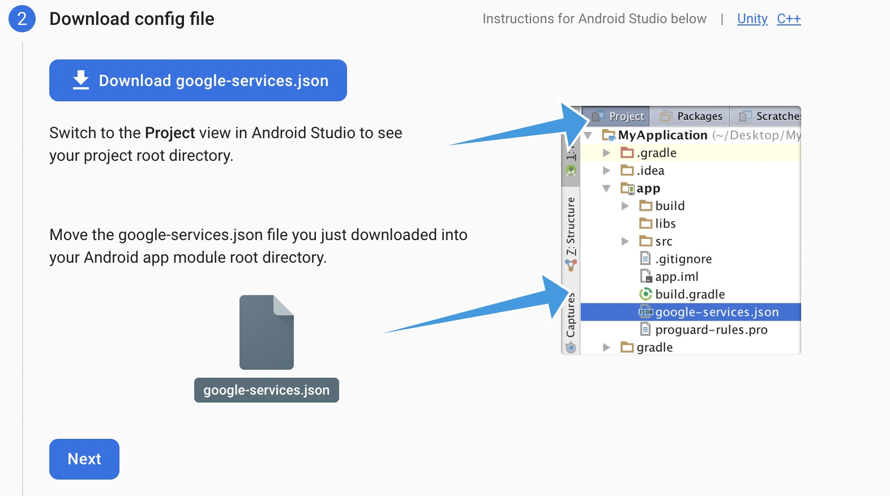
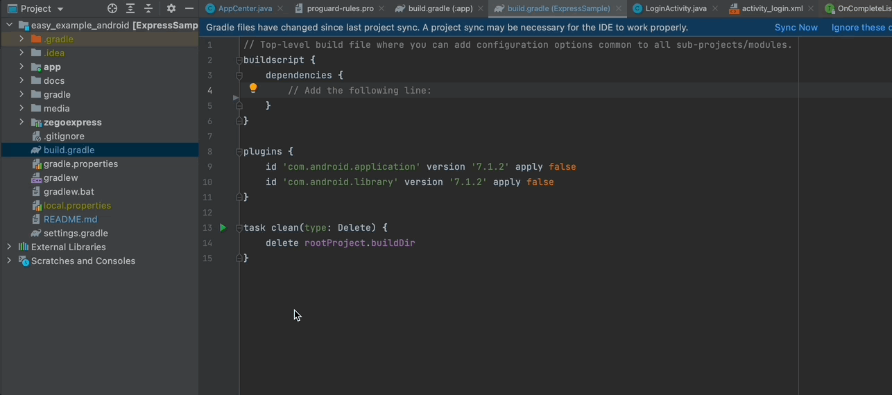
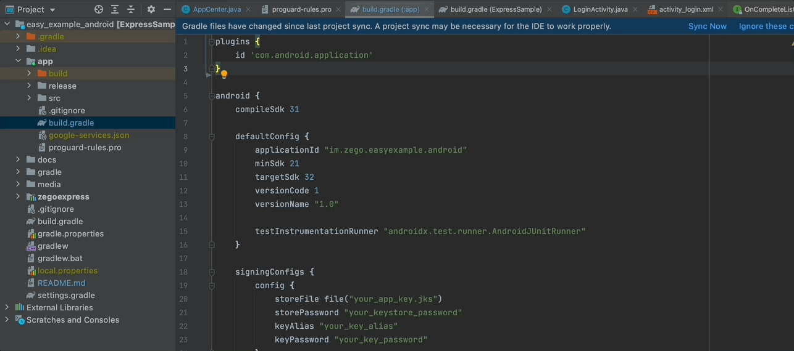
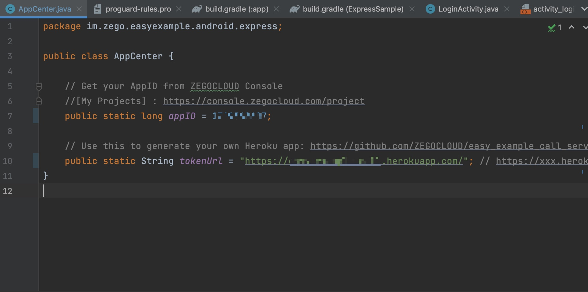
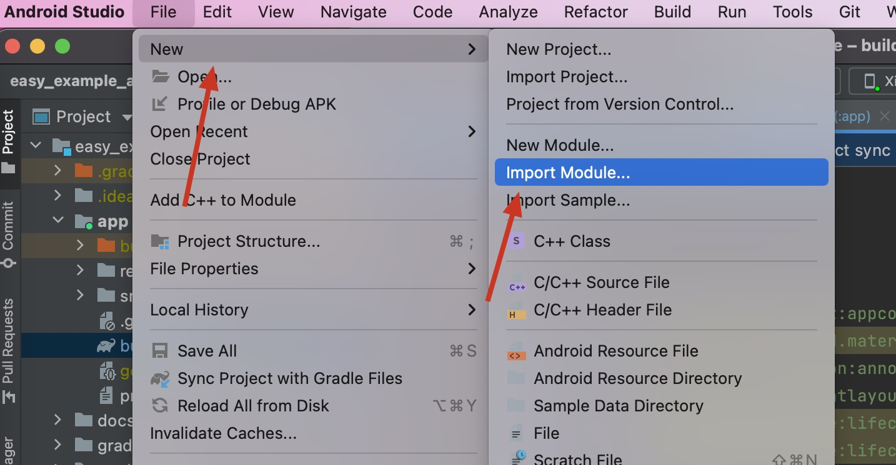
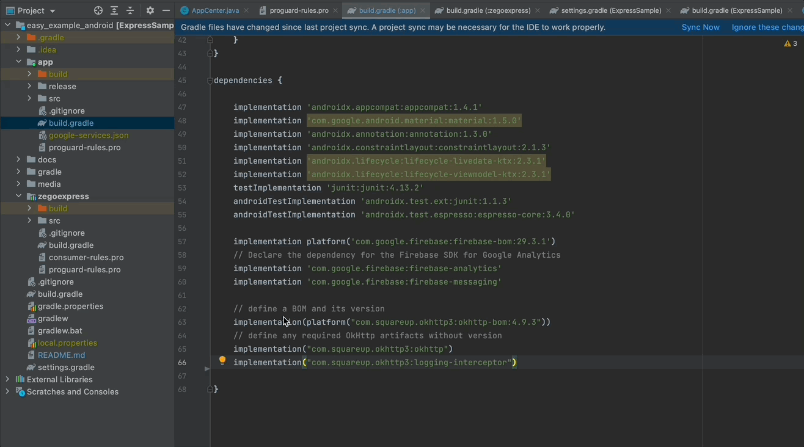

# ZEGOCLOUD easy example
<p align="center">
    <a href="https://github.com/ZEGOCLOUD/easy_example_android/releases"></a>
    <a href="https://discord.gg/EtNRATttyp">
        
    </a>
    <p>
    <p>Click the search button below to search documentation or error code</p>
    <a href="https://docs.zegocloud.com/">
        
    </a>
    </p>
</p>

ZEGOCLOUD's easy example is a simple wrapper around our RTC product. You can refer to the sample code for quick integration.

## Getting started

### Prerequisites

* [Android Studio Bumblebee or later](https://developer.android.com/studio)
* An Android device or Simulator that is running on Android 5.1 or later and supports audio and video. We recommend you use a real device.
* Create a project in [ZEGOCLOUD Admin Console](https://console.zegocloud.com/). For details, see [ZEGO Admin Console - Project management](https://docs.zegocloud.com/article/1271).

###  Clone the repository
1. Clone the easy example Github repository. 
2. Checkout to `call_invite` branch

### Setup FCM

1. Go to [Firebase Console](https://console.firebase.google.com/) and create new project if you don't have one.
2. Andd new `Android` app to your Firebase project. Download the `google-service.json` file and  move it into your Android app module root directory.

3.  Add the google-services plugin as a dependency inside of your `/android/build.gradle` file:

```xml
buildscript {
  dependencies {
    // ... other dependencies
    classpath 'com.google.gms:google-services:4.3.10'
    // Add me --- /\
  }
}
```
4. Execute the plugin by adding the following to your `/android/app/build.gradle` file:

```xml
apply plugin: 'com.android.application'
apply plugin: 'com.google.gms.google-services' // <- Add this line
```

### Modify the project configurations

- You need to modify `appID` to your own account, which can be obtained in the [ZEGO Admin Console](https://console.zegocloud.com/).
- You need to set `serverUrl` to a valid URL that can be obtained for Zego auth token and post FCM notification request.
> We use Heroku for test backen service, you can deploy the token generation service by one simple click.
>
> [](https://heroku.com/deploy?template=https://github.com/ZEGOCLOUD/easy_example_call_server_nodejs)
>
> Once deployed completed, you will get an url for your instance, try accessing `https://<heroku url>/access_token?uid=1234` to check if it works.
> 
> Check [easy_example_call_server_nodejs](https://github.com/ZEGOCLOUD/easy_example_call_server_nodejs) for more details.
> 
> Note⚠️⚠️⚠️: There are some limitations for Heroku free account, please check this [Free Dyno Hours](https://devcenter.heroku.com/articles/free-dyno-hours) if you want to use Heroku for your production service.

### Run the sample code

1. Connect the Android device to your computer.

2. Open Android Studio, select the Android device you are using,click the **Run 'app'** in the upper center to run the sample code and experience the Live Audio Room service.

## Integrate into your own project

### Introduce SDK

In your `setting.gradle` file, add the jitpack maven .
``` groovy
pluginManagement {
    repositories {
        
        maven { url 'https://www.jitpack.io' } // <- Add this line
    }
}
dependencyResolutionManagement {
    repositoriesMode.set(RepositoriesMode.FAIL_ON_PROJECT_REPOS)
    repositories {
        maven { url 'https://www.jitpack.io' } // <- Add this line
    }
}
```

### Import the source code module

import the `:zegoexpress` module to your project


Choose the `zegoexpress` directory. 
And add
dependency in your app's build.gradle's dependencies:

```groovy
dependencies{
   implementation project(':zegoexpress') 
}
```

### Setup FCM
Same as [getting started section](#setup-fcm).

### Setup backend service
1. Generate `Firebase Admin SDK Private Key`


2. Click this deploy button to start deploy your service:

[](https://heroku.com/deploy?template=https://github.com/ZEGOCLOUD/easy_example_call_server_nodejs)

If you are using [Firebase Cloud Functions](https://firebase.google.com/docs/functions), check [this doc](https://firebase.google.com/docs/cloud-messaging/send-message#send-messages-to-specific-devices) for usage and check [this example code](https://github.com/ZEGOCLOUD/easy_example_call_server_nodejs/blob/master/index.js) to make the FCM work with your project.


### Method call
The calling sequence of the SDK interface is as follows:
createEngine --> joinRoom --> setLocalVideoView/setRemoteVideoView --> leaveRoom


#### Create engine

Before using the SDK function, you need to create the instance of the SDK(Engine) first. We recommend creating it when the application starts. The sample code is as follows:
```java
 ExpressManager.getInstance().createEngine(getApplication(), AppCenter.appID);
```

#### Join room

When you want to communicate with audio and video, you need to call the join room interface first. 

If you need to invite other to join the call, you can send the invitation at the same time while you join the room.

```java
binding.callUser.setOnClickListener(new OnClickListener() {
    @Override
    public void onClick(View v) {
        PermissionX.init(LoginActivity.this)
            .permissions(Manifest.permission.CAMERA, Manifest.permission.RECORD_AUDIO)
            .request((allGranted, grantedList, deniedList) -> {
                if (allGranted) {
                    CloudMessage cloudMessage = new CloudMessage();
                    cloudMessage.targetUserID = binding.targetUserId.getText().toString();
                    cloudMessage.roomID = selfID;
                    cloudMessage.callType = "Video";
                    cloudMessage.callerUserID = selfID;
                    cloudMessage.callerUserName = selfName;
                    cloudMessage.callerIconUrl = selfIcon
                    HttpClient.getInstance().callUserByCloudMessage(cloudMessage, new HttpResult() {
                        @Override
                        public void onResult(int errorCode, String result) {
                            if (errorCode == 0) {
                                joinRoom(cloudMessage.roomID, cloudMessage.callerUserID,
                                    cloudMessage.callerUserName);
                            } else {
                                Toast.makeText(getApplication(), "callUserByCloudMessage failed:" + result,
                                    Toast.LENGTH_LONG).show();
                            }
                        }
                    });
                }
            });
    }
});
```
#### set video view

If your project needs to use the video communication function, you need to set the View for displaying the video, call `setLocalVideoView` for the local video, and call `setRemoteVideoView` for the remote video.

**setLocalVideoView:**
```java
ExpressManager.getInstance().setLocalVideoView(binding.localTexture);
```

**setLocalVideoView:**
```java
@Override
public void onRoomUserUpdate(String roomID, ZegoUpdateType updateType, ArrayList<ZegoUser> userList) {
    if (updateType == ZegoUpdateType.ADD) {
        for (int i = 0; i < userList.size(); i++) {
            ZegoUser user = userList.get(i);
            TextureView remoteTexture = binding.remoteTexture;
            binding.remoteName.setText(user.userName);
            setRemoteViewVisible(true);
            ExpressManager.getInstance().setRemoteVideoView(user.userID, remoteTexture);
        }
    } else {
        setRemoteViewVisible(false);
    }
}
```

#### leave room
When you want to leave the room, you can call the leaveroom interface.
```java
ExpressManager.getInstance().leaveRoom();
```
