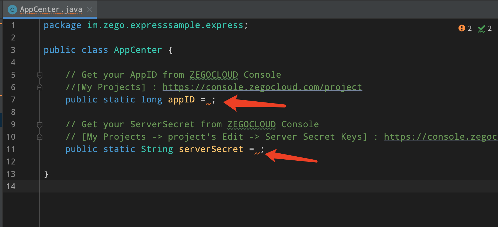
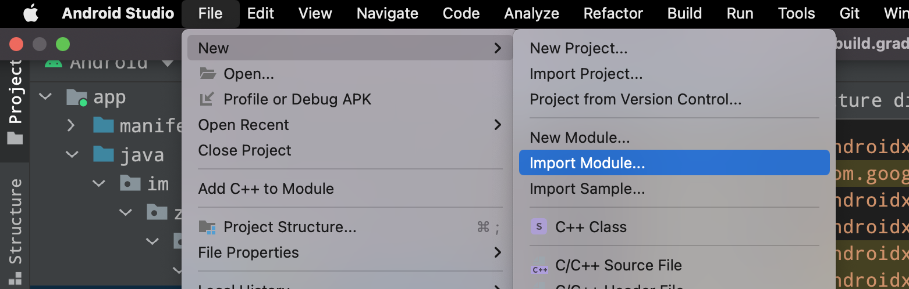

# ZEGOCLOUD easy example
ZEGOCLOUD's easy example is a simple wrapper around our RTC product. You can refer to the sample code for quick integration.

## Getting started

### Prerequisites

* [Android Studio Bumblebee or later](https://developer.android.com/studio)
* An Android device or Simulator that is running on Android 5.1 or later and supports audio and video. We recommend you use a real device.
* Create a project in [ZEGOCLOUD Admin Console](https://console.zegocloud.com/). For details, see [ZEGO Admin Console - Project management](https://docs.zegocloud.com/article/1271).

###  Clone the repository
1. Clone the easy example Github repository,and checkout to `live_streaming` branch

### Modify the project configurations

You need to modify `appID` and `serverSecret` to your own account, which can be obtained in the [ZEGO Admin Console](https://console.zegocloud.com/).

### Run the sample code

1. Connect the Android device to your computer.

2. Open Android Studio, select the Android device you are using,click the **Run 'app'** in the upper center to run the sample code and experience the Live Audio Room service.

## Integrate the SDK into your own project

### Introduce SDK
1. In your project's settings.gradle file, add the jitpack maven .
``` groovy
    pluginManagement {
    repositories {
        
        maven { url 'https://www.jitpack.io' }
    }
}
dependencyResolutionManagement {
    repositoriesMode.set(RepositoriesMode.FAIL_ON_PROJECT_REPOS)
    repositories {
        maven { url 'https://www.jitpack.io' }
    }
}
```

### Import the source code module
import the `:zegoexpress` module to your project
,choose the zegoexpress directory. 
And add
dependency in your app's build.gradle's dependencies:
```groovy
dependencies{
   implementation project(':zegoexpress') 
}
 
```
### Method call
The calling sequence of the SDK interface is as follows:
createEngine --> joinRoom --> setLocalVideoView/setRemoteVideoView --> leaveRoom

#### Create engine
Before using the SDK function, you need to create the SDK first. We recommend creating it when the application starts. The sample code is as follows:
```java
 ExpressManager.getInstance().createEngine(getApplication(), AppCenter.appID);
```
### Request camera and audio Permission
```java
 PermissionX.init(this)
    .permissions(Manifest.permission.CAMERA, Manifest.permission.RECORD_AUDIO)
    .request((allGranted, grantedList, deniedList) -> {
    });
```

#### Join room
When you want to communicate with audio and video, you need to call the join room interface first. According to your business scenario, you can set different audio and video controls through options, such as:

1. call scene：[.autoPlayVideo, .autoPlayAudio, .publishLocalAudio, .publishLocalVideo]
2. Live scene - host: [.autoPlayVideo, .autoPlayAudio, .publishLocalAudio, .publishLocalVideo]
3. Live scene - audience:[.autoPlayVideo, .autoPlayAudio]
4. Chat room - host:[.autoPlayAudio, .publishLocalAudio]
5. Chat room - audience:[.autoPlayAudio]

The following sample code is an example of a Live scenario:
```java
private void joinRoom(String roomID, boolean joinAsHost, IZegoRoomLoginCallback callback) {
        String userID = System.currentTimeMillis() + "";
        String username = Build.MANUFACTURER + random.nextInt(2048);
        ZegoUser user = new ZegoUser(userID, username);
        String token = ExpressManager.generateToken(userID, AppCenter.appID, AppCenter.serverSecret);
        int mediaOptions = ZegoMediaOptions.autoPlayAudio | ZegoMediaOptions.autoPlayVideo;
        if (joinAsHost) {
            mediaOptions = mediaOptions |
                ZegoMediaOptions.publishLocalAudio | ZegoMediaOptions.publishLocalVideo;
        }
        ExpressManager.getInstance().joinRoom(roomID, user, token, mediaOptions, new IZegoRoomLoginCallback() {
            @Override
            public void onRoomLoginResult(int errorCode, JSONObject jsonObject) {
                binding.loginLoading.setVisibility(View.GONE);
                if (callback != null) {
                    callback.onRoomLoginResult(errorCode, jsonObject);
                }
            }
        });
    }
```

#### leave room
When you want to leave the room, you can call the leaveroom interface.
```java
 ExpressManager.getInstance().leaveRoom();
```
